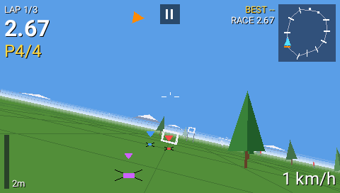
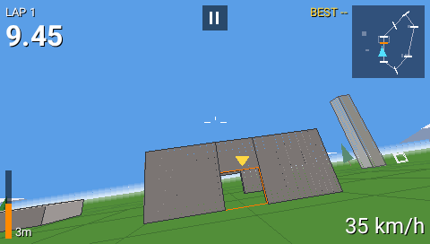
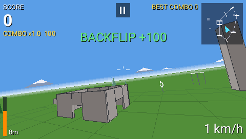
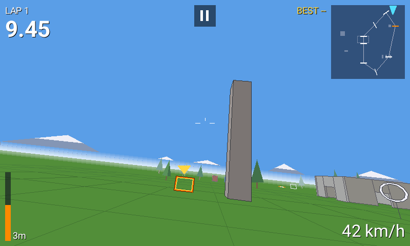
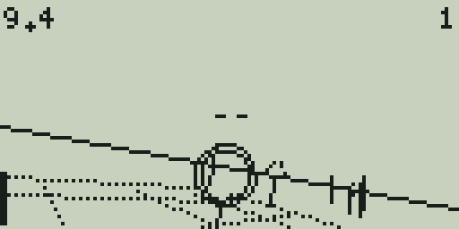
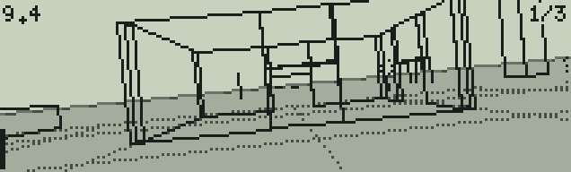

# StickTime

A real 3D FPV quad simulator that runs **on your radio** as an EdgeTX Lua tool. Race AI pilots, fly freestyle around a bando or chase gates against the clock, with nothing but your radio. Color screens get filled 3D, black & white radios get wireframe 3D, and older B&W radios with little memory get **StickTime Lite**.

**[Play it in your browser](https://juricabi.github.io/sticktime/)** · **[Download for your radio](https://github.com/juricabi/sticktime/releases/latest)** · EdgeTX 2.11 or newer (the color version also runs on older EdgeTX) · free software, GPL-2.0

| TX16S · race against AI pilots | TX16S · the Bando | TX16S · freestyle |
|---|---|---|
|  |  |  |
| **TX16S MK3 (800×480) · tower and dive gate** | **TX12 MkII (128×64) · StickTime BW** | **X9D (212×64 grey) · StickTime Lite** |
|  |  |  |

## Install

Download `StickTime-<version>-sdcard.zip` from the [latest release](https://github.com/juricabi/sticktime/releases/latest), copy what your radio needs from its `SCRIPTS/TOOLS/` to `/SCRIPTS/TOOLS/` on the SD card, and start it from **SYS → Tools**. The first start on a color radio takes a few seconds while EdgeTX compiles it.

| Radio | Copy | EdgeTX |
|---|---|---|
| Any color screen | `StickTime.lua` | 2.11+, older works too |
| B&W with an STM32F4: TX12 MkII, Zorro, Boxer, Pocket, MT12, GX12, X9D+ 2019, X9E, X7 ACCESS, T14, T20, T-Pro V2 / S, T12 Max, Bumblebee, Commando 8 | `StickTimeBW.lua` and the `StickTimeBW` folder | 2.11+ |
| Older B&W (STM32F2): TX12 MkI, X7, X9D, X9D+, X9 Lite, X-Lite, T12, T8, T-Lite, T-Pro, LR3 Pro | `StickTimeLite.lua` and the `StickTimeLite` folder | 2.11 (their last EdgeTX) |

On EdgeTX 2.10 and older the B&W versions don't start: they say "Needs EdgeTX 2.11 or newer" on the radio.

> **Safety:** the radio keeps transmitting your sticks while the sim runs. Unplug the quad's battery or switch the RF module off first.

StickTime BW and StickTime Lite also run on color radios, drawn in B&W style at the screen's full resolution, which is faster on slow radios. StickTime was called FPV Sim up to version 1.2: it takes over FPV Sim's settings and best times on its first start, after which the old `FPVSim…` and `FPVLite…` files can go.

## Features

- **Flight model.** Props lose thrust as the air through them speeds up; rotor drag in the prop plane makes the quad carve like a real 5" (a sideways slide halves in about 2 s); quadratic body drag; ground effect near the ground and roofs (up to 12% more thrust); motors that spool up in 20–30 ms and a DShot-style 1.5% idle, so you drop instead of floating. All at 80 Hz. At the default 6:1: about 130 km/h top speed, 115 km/h punch-outs, 65 km/h flat fall.
- **Your quad.** **Racer** (snappy, the most grip) or **Freestyle** (heavier, carries more momentum). Power from 3:1 to 12:1, Acro or Angle mode.
- **Rates.** Betaflight Actual rates: Soft, Normal and Fast presets, or Custom center sensitivity (10–500 deg/s), max rate (100–2000 deg/s) and expo (0.00–1.00) for roll/pitch and yaw, in Betaflight's own steps (10 deg/s and 0.01), so your Actual rates go in exactly as they are. Hold a key or spin the wheel quickly for five times bigger steps.
- **Eight tracks.** Meadow, Figure 8, Dive Tower, Slalom, Hoop Forest, Grand Prix, the **Bando** (an open-roof ruin with doors to fly through, a 24 m tower and stacked containers) and **Pro Track**, laid out like a real race: lanes up and down the field joined by flag hairpins, a high gate and a dive gate on the start straight, and a split-S. Gates, high gates, dive gates, hoops, arches, flags (pass on the marked side, shown by a yellow marker) and gaps in walls. Trees, poles, walls and structures are solid.
- **Four ways to play.**
    - **Race** up to three AI pilots (Easy, Medium, Hard) with a live position and a results screen.
    - **Practice**: lap times against your best.
    - **Freestyle**: flips, rolls, 360s, power loops, dives, hang time, gap shots and proximity runs score points; chain them within 2.5 s for up to a ×4 combo.
    - **Gate Rush**: 30 s on the clock, every gate adds time and lights the next one at random.
- **Wind** (off, light, strong, with gusts; each track has its own direction, shown by a small arrow on the OSD: up is where your nose points), optional **prop wash**, beeps for the countdown, gates and laps, and a **vibration** on crashes and laps (On, Off).
- **Saved per track:** best lap, race, combo and Gate Rush score, plus all settings.
- **Color radios:** filled sky and ground, haze and fog, mountains, shaded structures, an FPV-style OSD, a minimap with the AI pilots, optional stick view and FPS, and touch. **B&W radios:** the same game in wireframe, with greyscale ground on 212×64 screens. **Lite:** the same flight model, quads and tracks, with Time trial, Practice, Freestyle and Gate Rush; no AI pilots, custom rates or prop wash.

## Controls

| | |
|---|---|
| Sticks | fly the quad (the radio applies your stick mode) |
| ENTER | select; on a setting, edit it and change it with the wheel or +/- |
| EXIT | pause while flying, back in menus, quit from the main menu; long EXIT closes the tool on color radios |
| Wheel, +/-, up/down | move through menus |
| Touch | tap rows; on a setting tap the left or right part to step back or forward; the pause button is at the top |

## Screens

| Screen | Radios |
|---|---|
| 480×272 | RadioMaster TX16S / MkII, FrSky X10 / X10S / X12S, Jumper T16 / T18, HelloRadioSky V16, Fatfish F16, iFlight Commando 14, Senduwing H17 |
| 480×320 | RadioMaster TX15 / GX15, Jumper T15 / T15 Pro / T22, FlySky PL18 / PL18EV / PL18U / ST16 |
| 320×480 | FlySky NV14, EL18, NB4+ (portrait: FPV view on top, instruments below) |
| 320×240 | FlySky PA01, HelloRadioSky V12 |
| 800×480 | RadioMaster TX16S MK3 |
| 212×64 grey | FrSky X9D+ 2019, X9E (StickTime BW); X9D, X9D+ (Lite) |
| 128×64 | the other B&W radios in the install table |

The layout follows `LCD_W` / `LCD_H` and the radio's real font sizes, so new screen sizes work too.

## Faster firmware (optional)

Stock EdgeTX runs a tool at most every 50 ms (20 fps) and shows each frame one cycle late. The [`fast-lua-20ms` prerelease](https://github.com/juricabi/edgetx/releases/tag/fast-lua-20ms) has firmware for every color radio (EdgeTX `main` plus [`firmware/edgetx-fast-lua.patch`](firmware/edgetx-fast-lua.patch)): Lua tools run every 20 ms, frames show at once, and drawing is much faster. On every STM32H750 radio (RadioMaster TX16S MK3, TX15 and GX15, Jumper T15 Pro, HelloRadioSky V12 and V15, and more) it also runs the Lua interpreter from ITCM. On the HelloRadioSky V12 and the Flysky PA01, whose screens hang on an SPI bus, it also sends frames to the screen in the background. On the V12 that makes 38 fps even in the Bando, and stick-to-screen latency drops from about 90 ms to about 40 ms. With **Show FPS** on, StickTime shows how long each frame took to run and to reach the screen. These are test builds: back up your SD card first.

<details>
<summary>What the patch changes</summary>

While a Lua tool is open:

- the UI loop runs every 20 ms instead of 50 ms, and goes back to 50 ms when the tool closes;
- each frame goes to the screen as soon as the script has drawn it (`lv_refr_now`), not at the next cycle;
- solid lines, rectangles and filled triangles go straight into the tool's canvas, instead of through an LVGL canvas call per shape (per row of a filled triangle), which is what made the Bando slow;
- H7 radios no longer flush the whole data cache on every `lcd.drawLine`;
- the tool gets `TOOL_RUN_US` and `TOOL_SHOW_US`: how long its last `run()` and putting that frame on the screen took.

On the STM32H750 radios (every target linked with `stm32h750_sdram`: tx16smk3, tx15, gx15, t15pro, t15h7, t22, pa01, st16, c14, h17, v12, v15), whose firmware runs from SDRAM through a 16 KB instruction cache, the Lua interpreter and the drawing code behind the `lcd` functions run from the H750's 64 KB ITCM, which stock EdgeTX leaves empty, compiled for speed (about 49 KB of it). The STM32F429 radios have no ITCM, and need it less: their firmware runs from internal flash.

On the HelloRadioSky V12 and the Flysky PA01 (320×240 SPI screens) frames also go out in the background: the screen's vertical blank (FMARK) starts the SPI transfer (13 ms on the V12, 25 ms on the PA01) and its interrupt finishes it, while the CPU already runs the next frame. The PA01 has not been tried on a real radio yet.

The mixer task (sticks, mixes, RF, telemetry) keeps its higher priority and is not touched. `tools/build_firmware.sh v12` clones EdgeTX `main`, applies the patch and builds one radio's firmware (any target from EdgeTX's `tools/build-common.sh`, ARM GCC 14.2 on the `PATH`). The same changes are on the `fast-lua-20ms` branch of [juricabi/edgetx](https://github.com/juricabi/edgetx/tree/fast-lua-20ms), whose CI publishes the prerelease.

The script is ready for any frame rate: physics runs in 80 Hz substeps on the measured frame time (the tests fly every track at 50, 20 and 16 ms per frame, and lap times agree within a few tenths), the 10 ms `getTime()` steps are smoothed, and the camera is drawn ahead by the measured display delay. To set that delay by hand, set the global `STICKTIME_LAT` in seconds (`0` turns the prediction off).
</details>

## Browser emulator

Play at **[juricabi.github.io/sticktime](https://juricabi.github.io/sticktime/)**, or open `web/simulator.html` (one file, works offline) in Chrome, Edge or Firefox. It runs the real `.lua` files in a Lua 5.3 VM with an EdgeTX-style API, drawn pixel by pixel the way the firmware draws.

- Any radio screen, color or B&W, or **PC screen** (1280×720 at 60 fps); **Fullscreen** with F.
- Fly with the keyboard (W/S throttle, A/D yaw, arrows for pitch and roll), the on-screen gimbals, or your radio as a USB joystick (**Radio / gamepad**, then map the axes).
- **Sound on** plays the beeps.
- Real radio refresh (20 Hz) and the color screen's one-frame delay are on by default and can be turned off; B&W LCD ghosting is optional.
- **Radio load** estimates the frame time on F2, F4 and H7 radios; **Open .lua** runs any other EdgeTX tool script.

## Under the hood

<details>
<summary>Memory on B&W radios</summary>

B&W radios have no external RAM, and compiling a script on the radio takes far more memory than running it. So both B&W versions ship precompiled: `game.luac` is EdgeTX's Lua 5.3 bytecode (made by EdgeTX's own Lua), and `StickTimeBW.lua` / `StickTimeLite.lua` are small loaders that load only that. Compiling on the radio would need about 200 KB for StickTime BW and 135 KB for the Lite, more than any B&W radio has, and running out of memory can crash the radio. That is also why the binary is not called `core.luac` next to its source `core.lua`: EdgeTX compiles `x.lua` instead of loading `x.luac` whenever the source's file time is newer, which a copy that does not keep file times can cause. EdgeTX 2.10 and older use Lua 5.2 and can't load the bytecode: hence EdgeTX 2.11+. A Lua 5.2 build would not get StickTime BW onto them either: on 2.10's Lua it needs about 110 KB of heap, and 2.10 doesn't give STM32F4 radios the CCM pool that 2.11 added for Lua (`tools/build_etxhost.sh v2.10.7` builds 2.10's Lua for the memory test). When the game can't load (EdgeTX too old, too little memory, the folder missing), the loader says what to do on a screen of its own: EdgeTX's error box would show a 128×64 radio only the end of a long message.

Measured on EdgeTX 2.11's own Lua core (the tests also run main's, which packs values tighter and needs about 10% less) with a model of the radio's allocator (newlib-nano malloc with its fragmentation, EdgeTX's small-block pools or CCM pool), loading through the loader and playing every track and mode:

| | Heap for Lua (EdgeTX 2.11.3) | Lua memory while playing | Peak heap use |
|---|---|---|---|
| StickTime BW on STM32F4 | 114–121 KB + 34 KB CCM | about 90 KB | 84 KB + 34 KB CCM |
| StickTime Lite on STM32F2 | 63–73 KB + 10 KB pools | about 49 KB | 58 KB + 10 KB pools |

The Lite still runs with a 58 KB heap, so about 5 KB of an X9D+ stays free. It reads each track from its file (`StickTimeLite/t1.txt` to `t8.txt`) only when you pick it, parses numbers without making a string for each, and collects garbage before the flight starts.
</details>

<details>
<summary>How it stays fast on a radio</summary>

- **Fills.** Sky and ground are one rectangle plus one thin wedge triangle at any roll. Walls and structures are two filled triangles per face, filled row by row in C by the firmware. Upright bars and hoop segments are 1 px "ruled" lines. Faces cut by the near plane go through a polygon clipper.
- **Lua side.** World data lives in arrays of numbers, hot values in locals and upvalues, no tables are made per frame, and collisions use a per-frame broad phase. Far gates switch to an outline and far hoops to six segments.
- **Draw order.** Depth order alone fails with long walls, so for each pair that overlaps on screen and involves a structure, the script finds a plane separating their bounding boxes and draws the far side first, then sorts topologically. A ray-cast test over hundreds of camera poses at the Bando finds no pair out of order.
- **Per frame:** about 15–65k Lua VM instructions on color screens and 7–28k on B&W. The emulator estimates 15–17 ms on a TX16S-class radio on open tracks and 27–35 ms in the busiest Bando views, and 4–11 ms for the Lite on an STM32F2 with no FPU, all inside the 50 ms budget.
- **Latency.** Color screens show each frame one UI cycle after it is drawn, so the camera is drawn where the quad will be when the frame appears, and a third of that ahead in its turn; more would make a fast roll overshoot when the stick centers.
</details>

<details>
<summary>EdgeTX quirks the script works around</summary>

- The color `lcd.drawLine` silently drops a line with an end past the right or bottom edge (`x > LCD_W` or `y > LCD_H`), so the script clips those edges itself; the tests fail on any line the firmware would drop.
- EdgeTX builds Lua 5.3 with `LUA_FLOORN2I`, and releases before the 2026-08-30 fix (#7611) floor floats in int/float equality (`0.02 ~= 0` is `false`), so the script never compares a float with an integer literal.
- The B&W `lcd.drawLine` refuses points outside the screen and draws in XOR unless `FORCE` is set, so lines are clipped in Lua and drawn with `FORCE`.
- `loadScript(path, mode, env)` clears the Lua stack before reading `env`, so the chunk gets a nil environment (`attempt to index a nil value (upvalue '_ENV')`). The B&W games' `color.lua` sets `lcd` and the flags as plain globals instead: a tool has a Lua state of its own on color radios. The tests and the emulator reproduce EdgeTX's behavior.
</details>

## Development

<details>
<summary>Files, build and tests</summary>

```
src/sticktime.lua       single source of the color and B&W versions (--#if COLOR / --#if BW blocks)
src/sticktime_lite.lua  StickTime Lite (--#if TEST: hooks for the tests, left out of the radio file)
src/sticktime_lite_tracks.txt
                        the Lite's tracks (build.py writes StickTimeLite/t1.txt ... t8.txt)
src/bwloader.lua        the B&W loaders (they load only the precompiled game.luac)
src/bwcolor.lua         StickTimeBW/color.lua and StickTimeLite/color.lua: the B&W core on a color radio
build.py                -> sdcard/SCRIPTS/TOOLS/ (StickTime.lua, StickTimeBW*, StickTimeLite*)
web/src/                emulator: engine.js (EdgeTX API + LCD), app.js (UI), style.css, index.html
tools/bundle_web.py     -> web/simulator.html (offline, single file) and web/artifact.html
tools/build_etxlua.sh   Lua 5.3 with EdgeTX's number settings (native and 32-bit) for the tests
tools/build_etxhost.sh  EdgeTX's own Lua core with a model of the B&W radios' allocator: makes the
                        game.luac files and runs test/memtest.lua (main, or a release: v2.11.4, v2.10.7)
tools/tune_physics.py   steady-state check of the flight model (top speed, punch-out, fall, braking)
tools/build_firmware.sh EdgeTX main + firmware/edgetx-fast-lua.patch for one radio
test/harness.lua        headless EdgeTX mock: autopilot races with AI pilots on every track, flags, hoops,
                        dive gates, freestyle, gate rush, ground effect, vibration, menus, crashes, saves
test/lite_test.lua      the same for the Lite, as a radio with +/- keys and without the libraries B&W lacks
test/order_check.lua    ray-cast check of the draw order at the Bando
test/memtest.lua        memory of the B&W versions through their loaders on F2 / F4 radio models
test/msgtest.lua        the loaders' own screen where the game can't start (EdgeTX 2.10, too little memory)
test/run_all.sh         all of the above, every screen size, Lua 5.3 and 5.2
test/web_shots.py       Playwright screenshots of every radio and mode in the emulator
.github/workflows/      pages.yml publishes the emulator as the project site; release.yml attaches
                        StickTime-X.Y-sdcard.zip to release vX.Y with docs/releases/vX.Y.md as notes
```

```
tools/build_etxlua.sh && tools/build_etxhost.sh && python3 build.py && python3 tools/bundle_web.py
test/run_all.sh
```
</details>

## Credits and license

Idea from [lua-fpv-sim](https://github.com/alexeystn/lua-fpv-sim) by Alexey Stankevich, the first FPV sim on OpenTX; StickTime is an independent rewrite with a 3D engine. StickTime is free software under the [GNU General Public License v2](LICENSE), like EdgeTX. The emulator includes the [fengari](https://fengari.io) Lua VM (MIT), the Roboto font (SIL Open Font License) and the X11 misc-fixed bitmap fonts (public domain); their license texts are in `web/vendor/`.
