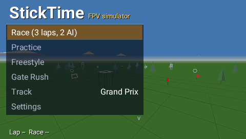
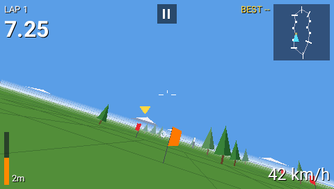
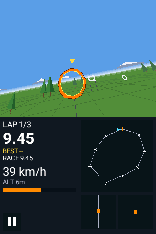
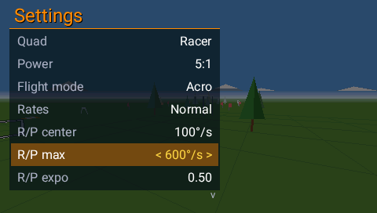
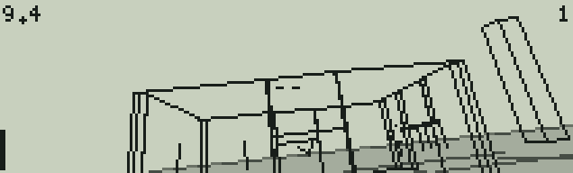
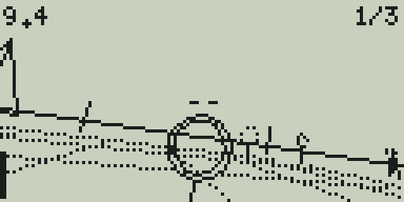
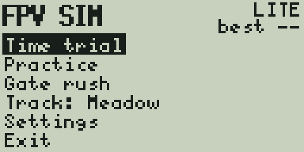

# StickTime

**StickTime** is a real 3D FPV quad simulator that runs **on your radio** as an EdgeTX Lua tool, on every color screen and on black & white radios, with a **Lite** edition for older B&W radios that have little memory. Get stick time anywhere with nothing but your radio: race AI pilots, fly freestyle tricks around a bando, or chase gates against the clock. A browser emulator runs the very same scripts, so you can try it before copying it to the SD card.

StickTime was called FPV Sim up to version 1.2.



| TX16S · race against AI pilots | TX16S · the Bando | TX16S · Freestyle tricks |
|---|---|---|
|  |  |  |
| **TX16S · flag slalom** | **NV14 / EL18 (portrait) · Hoop Forest** | **TX16S MK3 · tower and dive gate** |
|  |  |  |
| **Settings: quad, power, rates** | **TX12 MkII / Zorro / Boxer (128×64)** | **X9D+ 2019 / X9E (212×64 grey)** |
|  |  |  |
| **StickTime Lite · X7, TX12 MkI, X-Lite (128×64) · Hoop Forest** | **StickTime Lite · X9D, X9D+ (212×64) · the Bando** | **StickTime Lite · menu** |
|  |  |  |

## Features

- **Flight model.** Props lose thrust as the airflow through them speeds up. There is rotor drag in the prop plane and quadratic body drag that depends on attitude, plus gravity and momentum. Both quads feel like a well-tuned build: the motors spool up in 20–30 ms and the rates follow your sticks in 12–20 ms. Zero throttle keeps 1.5% idle thrust, like DShot idle on a real quad, so you drop properly instead of floating. It all runs at 80 Hz. Top speed at 5:1 is about 130 km/h, punch-outs reach about 100 km/h, and a flat fall settles at 55–60 km/h.
- **Your quad.** Choose a **Racer** (snappy, light, the most grip) or a **Freestyle** quad (heavier: it carries more momentum and floats a little more). Power is a free choice from 3:1 to 12:1. Flight mode is Acro or Angle.
- **Rates.** Betaflight "actual" rates: Soft, Normal and Fast presets, or **Custom**, where you set center rate, max rate and expo for roll/pitch and for yaw. Editing any value switches to Custom, starting from the preset you had.
- **Latency.** Color screens show each frame one UI cycle after the script draws it, so the camera is rendered ahead: where the quad will be when the frame reaches the screen, and a third of that time ahead in its turn. Turning further ahead would make a fast roll overshoot and swing back when the stick centers. The prediction follows the measured frame interval, so it stays right on firmware that runs scripts faster (see [Faster firmware](#faster-firmware)). Physics applies your sticks for the whole interval since the last frame.
- **Seven tracks.** Meadow, Figure 8, Dive Tower, Slalom, Hoop Forest, Grand Prix and the **Bando**: an open-roof ruin with doors to fly through, a 24 m tower and stacked containers. Obstacles: gates, high gates, dive gates, hoops, arches, flags (pass on the marked side) and gaps in walls. Trees, legs, poles, walls and the tower are solid.
- **Four ways to play.**
  - **Race** against up to three AI pilots (Easy, Medium or Hard) with a live position, then a results screen with your place, total and lap times.
  - **Practice**: lap timing against your best.
  - **Freestyle**: flips, rolls, 360s, power loops, doubles, dives, hang time, gap shots and proximity runs score points. Chain them within 2.5 s for a combo multiplier (up to ×4). Crash and the combo is lost. Your best combo is saved.
  - **Gate Rush**: 30 seconds on the clock. Every gate you hit adds time and lights the next one at random, in either direction.
- **Wind and prop wash.** Wind is off, light or strong, with gusts, weaker near the ground. Prop wash (a wobble when you descend into your own downwash) is a setting, off by default.
- **Saved per track:** best lap, best race, best combo and best Gate Rush score, plus all settings.
- **Color radios.** Filled sky and ground at any attitude, horizon haze, distance fog, mountains, shaded structures, an FPV-style OSD (lap timer, best lap, race clock, position, speed, altitude, throttle bar, next-gate marker and arrow), minimap with AI pilots, optional stick view and FPS. Touch works on touch radios.
- **B&W radios.** The same game in wireframe 3D, with greyscale ground on 212×64 screens.
- **StickTime Lite** for B&W radios with little memory (STM32F2: X7, X9D, X9D+, X9 Lite, X-Lite, TX12 MkI, T12, T8, T-Lite, T-Pro, LR3 Pro). The same flight model and quads, all seven tracks with every obstacle (the Bando, hoops and flags included), **Time trial**, **Practice**, **Freestyle** with combos and **Gate Rush**, wind, greyscale ground on 212×64 screens, best lap, race, combo and Gate Rush score per track, and the main settings: quad, power, flight mode, rates (Soft, Normal, Fast), camera tilt, laps and wind. Left out to fit in that memory: the AI pilots, custom rates and prop wash. The tracks are small text files (`StickTimeLite/t1.txt` to `t7.txt`) that the game reads when you pick one.

## Install

1. Copy from this repository's `sdcard/SCRIPTS/TOOLS/` to `/SCRIPTS/TOOLS/` on the radio's SD card:
   - **Color radios:** `StickTime.lua`
   - **B&W radios with an STM32F4** (see the table below): `StickTimeBW.lua` **and** the `StickTimeBW` folder
   - **Older B&W radios (STM32F2):** `StickTimeLite.lua` **and** the `StickTimeLite` folder (the game and its seven track files). StickTime Lite runs on the other B&W radios too.
2. On the radio open **SYS → Tools** and start **StickTime** (or **StickTime BW**, **StickTime Lite**). The first start on a color radio takes a few seconds while EdgeTX compiles the script.

The B&W versions need **EdgeTX 2.11 or newer** (see below). The color version also runs on older EdgeTX. Started on a color radio, StickTime BW and StickTime Lite only show a note to start StickTime instead.

> **Safety:** the radio keeps transmitting your sticks while the sim runs. Unplug the quad's battery or switch the RF module off first.

**Coming from FPV Sim?** StickTime takes over FPV Sim's settings and best times (saved by any version since 1.0) the first time it starts. After that you can delete the old files: everything named `FPVSim…` or `FPVLite…` in `/SCRIPTS/TOOLS/`.

### B&W radios and memory

B&W radios have no external RAM. Compiling a script on the radio takes far more memory than running it, and a script compiled on the radio keeps its debug info for that run. So both B&W versions ship precompiled: the game is `core.luac` (EdgeTX's Lua 5.3 bytecode, made by EdgeTX's own Lua) next to its source `core.lua`, and `StickTimeBW.lua` / `StickTimeLite.lua` are small loaders that take `core.luac` first. Only if it is missing do they let EdgeTX compile `core.lua`, drop that copy and load the saved bytecode. EdgeTX 2.10 and older use Lua 5.2 and can't load this bytecode, so the radio would have to compile the game: that takes more than 150 KB for StickTime BW and about 120 KB for the Lite, more than any B&W radio has for the first and more than an STM32F2 radio has for the second.

Free memory for Lua, read from the official EdgeTX 2.11.3 firmware binaries:

| | Radios | Heap for Lua | Runs |
|---|---|---|---|
| STM32F4 | TX12 MkII, Zorro, Boxer, Pocket, MT12, GX12, X9D+ 2019, X9E, X7 ACCESS, T14, T20, T20 V2, T-Pro V2, T-Pro S, T12 Max, Bumblebee, Commando 8 | 114–121 KB + 34 KB CCM | StickTime BW, StickTime Lite |
| STM32F2 | TX12 (MkI), X7, X9D, X9D+ (pre-2019), X9 Lite / Lite S, X-Lite / X-Lite S, T12, T8, T-Lite, T-Pro, LR3 Pro | 63–73 KB + 10 KB small-block pools | StickTime Lite |

What the games need, measured on EdgeTX's own Lua core with a model of the radio's allocator (newlib-nano malloc with its fragmentation, EdgeTX's small-block pools or CCM pool), loading through the loader and playing every track and mode:

| | Lua memory while playing | Peak heap use | Fits in |
|---|---|---|---|
| StickTime BW | about 78 KB | 66 KB + 34 KB CCM | X9D+ 2019 (the smallest F4 heap): 114 KB + 34 KB CCM |
| StickTime Lite | about 43 KB | 48 KB + 10 KB pools | X9D, X9D+ (the smallest F2 heap): 63 KB + 10 KB pools |

The Lite still runs with a 49.5 KB heap, so about 14 KB of the X9D+'s memory stays free. To get there it reads each track from its file only when you pick it, parses the numbers without making a string for each one, and runs a full garbage collection before the flight starts.

## Controls

| | |
|---|---|
| Sticks | Fly the quad. The radio applies your stick mode (1–4). |
| ENTER | Select. On a setting it starts editing; turn or press +/- to change it. |
| EXIT | Pause while flying, back in menus, quit from the main menu. Long EXIT closes the tool on color radios. |
| Rotary, +/-, up/down | Move through menus. |
| Touch | Tap menu rows. On a setting, tap the left part to go back a value, the right part to go forward. The pause button sits at the top of the screen (bottom of the panel on portrait radios). |

Flags: a flag marks one side of the course. The yellow marker floats over the side to fly past, and passing on the other side does not count.

## Supported screens

| Screen | Radios |
|---|---|
| 480×272 | RadioMaster TX16S / MkII, FrSky X10 / X10S / X12S, Jumper T16 / T18, HelloRadioSky V16, Fatfish F16, iFlight Commando 14, Senduwing H17 |
| 480×320 | RadioMaster TX15 / GX15, Jumper T15 / T15 Pro / T22, FlySky PL18 / PL18EV / PL18U / ST16 |
| 320×480 | FlySky NV14, EL18, NB4+ (portrait: FPV view on top, instruments below) |
| 320×240 | FlySky PA01, HelloRadioSky V12 |
| 800×480 | RadioMaster TX16S MK3 |
| 212×64 grey | FrSky X9D+ 2019, X9E (StickTime BW); FrSky X9D, X9D+ (StickTime Lite) |
| 128×64 | RadioMaster TX12 MkII, Zorro, Boxer, Pocket, MT12, GX12, FrSky X7 ACCESS, Jumper T14, T20, T-Pro V2 / S, T12 Max, Bumblebee, iFlight Commando 8 (StickTime BW); RadioMaster TX12 MkI, T8, FrSky X7, X9 Lite / S, X-Lite / S, Jumper T12, T-Lite, T-Pro, LR3 Pro (StickTime Lite) |

The layout is computed from `LCD_W` / `LCD_H` and the radio's real font sizes, so new screen sizes work too. Tested with Lua 5.3 as configured in EdgeTX 2.11+ and with Lua 5.2 (EdgeTX 2.10 and older; the color version).

## How it stays fast on a radio

EdgeTX calls a tool script's `run()` at most every 50 ms, so the target is a steady 20 fps on the slowest color radios (STM32F429).

- **Timing.** The flight model uses `getTime()` deltas with 80 Hz substeps, so the flight is the same at any frame rate.
- **Fills.** Sky and ground are one rectangle plus one thin wedge triangle at any roll angle. Walls, the tower and the containers are two filled triangles per face: the firmware fills them row by row in C, which costs less than many lines drawn from Lua and leaves no gaps between them. Gate bars that run across are triangles too. Upright bars and hoop segments are filled with 1 px "ruled" lines (native Bresenham), as many as the bar is thick. Faces cut by the camera's near plane go through a polygon clipper.
- **Lua side.** World data is stored as arrays of numbers, hot values live in locals and upvalues, no tables are created per frame, and objects are depth-sorted with an insertion sort. Collisions use a per-frame broad phase. Far gates switch to a single outline and far hoops to six segments.
- **Draw order.** With walls, the tower or containers in view, depth order is not enough: a long wall's center can be far away while its near end covers everything behind it. For each pair that overlaps on screen and involves a structure, the script finds a plane that separates their bounding boxes and draws the object on the far side of it first, then a topological sort puts everything in order. A ray-cast test over hundreds of camera poses at the Bando finds no pair drawn in the wrong order.
- **Measured per frame:** about 15–65k Lua VM instructions on color screens and 7–28k on B&W screens, for StickTime BW and the Lite alike (the Lite up to 45k looking down over the whole Bando). The emulator estimates 15–17 ms per frame on a TX16S-class radio for the open tracks and 27–35 ms in the busiest Bando views, and 4–11 ms for the Lite on an STM32F2 radio with no FPU (17 ms over the whole Bando), inside the 50 ms budget.
- **Color `drawLine` quirk.** On every EdgeTX version the color `lcd.drawLine` silently drops the whole line if either end is past the right or bottom edge (`x > LCD_W` or `y > LCD_H`). Negative values are clipped by the firmware. The script clips the right and bottom edges itself, and the tests fail on any line the firmware would drop.
- **EdgeTX Lua quirk.** EdgeTX builds Lua 5.3 with `LUA_FLOORN2I`, and releases before the 2026-08-30 fix (#7611) also floor floats in int/float equality, so `0.02 ~= 0` is `false` on those radios. The script never compares a float with an integer literal.
- **B&W quirks.** `lcd.drawLine` on B&W radios refuses any point outside the screen and draws in XOR mode unless `FORCE` is set, so lines are clipped in Lua and drawn with `FORCE`.

## Faster firmware

Stock EdgeTX calls a tool's `run()` at most every 50 ms (`MENU_TASK_PERIOD` in `radio/src/tasks.cpp`), however fast the CPU is, and on color radios each frame appears one 50 ms cycle after the script draws it. The game does not speed up by itself: the firmware has to call it more often. A build or fork with a shorter period gets more frames, as far as the radio can draw them. H7 radios (TX15, TX16S MK3) need 10–25 ms per frame, so 40–60 fps is within reach. F4 radios (TX16S, T16) need up to about 40 ms in the busiest views and gain little.

[`firmware/edgetx-fast-lua.patch`](firmware/edgetx-fast-lua.patch) does both for color radios, and only while a Lua tool is open:

- the UI loop runs every 20 ms instead of 50 ms (up to 50 fps), and goes back to 50 ms when the tool closes;
- each frame goes to the screen as soon as the script has drawn it (`lv_refr_now`), not at the next cycle.

The mixer task (sticks, mixes, RF output, telemetry, watchdog) has a higher priority and is not touched. `tools/build_firmware.sh v12` clones EdgeTX `main`, applies the patch and builds the firmware for that radio (any target name from EdgeTX's `tools/build-common.sh`), with ARM GCC 14.2 on the `PATH`. On the HelloRadioSky V12, whose 320×240 screen is connected over SPI, every full frame takes about 13 ms to send plus the wait for the screen's refresh, so the game runs at about 30 fps there. Estimated stick-to-screen latency drops from about 90 ms to about 40 ms.

The script is ready for that:

- Physics runs in 80 Hz substeps on the measured time between frames, so the quad flies the same at 20, 50 or 60 fps. The tests fly every track at 50, 20 and 16 ms per frame, and the lap times agree within a few tenths of a second.
- `getTime()` only ticks every 10 ms, so the script smooths the frame interval before using it, and the camera does not jitter at 50–60 fps.
- The latency compensation scales with the measured frame interval. To set it by hand (from a fork, or at the top of the script), set the global `STICKTIME_LAT` to the display delay in seconds, or to `0` to turn the prediction off.

## Browser emulator

Open `web/simulator.html` in Chrome, Edge or Firefox. It runs the real `.lua` files in a Lua 5.3 VM with an EdgeTX-style API and draws them pixel by pixel the way the firmware does, including the line rule above.

- Pick any radio screen, color or B&W, or **PC screen**: 1280×720 at 60 fps with no radio limits, for playing and testing on a computer. **Fullscreen** (or the F key) fills the monitor, and B&W screens keep sharp pixels.
- Each script runs on its own kind of screen, as on a radio: StickTime on color screens and the PC screen, StickTime BW and StickTime Lite on B&W screens. Picking a script moves to a screen it runs on, and picking a screen switches to its script.
- Fly with the keyboard (W/S throttle, A/D yaw, arrows for pitch and roll), drag the on-screen gimbals, or plug in your radio as a USB joystick (choose **Radio / gamepad** and map the axes).
- Runs at the radio's 20 Hz by default (toggle **Real radio refresh**). Color screens show each frame one cycle late, like the radio (toggle **Color screen delay**). B&W LCD ghosting is optional.
- The **Radio load** panel counts Lua instructions and drawing work per frame and estimates the frame time on F4 and H7 radios.
- For StickTime Lite the **Radio load** panel estimates an STM32F2 radio.
- **Open .lua** runs any other EdgeTX tool script (`loadScript` reads from the virtual SD card).

## Development

```
src/sticktime.lua       single source for the color and B&W versions (--#if COLOR / --#if BW blocks)
src/sticktime_lite.lua  StickTime Lite (--#if TEST: hooks for the tests, left out of the radio file)
src/sticktime_lite_tracks.txt
                        the Lite's tracks, one line each (build.py writes StickTimeLite/t1.txt ... t7.txt)
src/bwloader.lua        the B&W loaders (precompiled core.luac first)
src/bwcolor.lua         what the B&W loaders show on a color radio instead of the game
build.py                -> sdcard/SCRIPTS/TOOLS/: StickTime.lua, StickTimeBW.lua + StickTimeBW/,
                        StickTimeLite.lua + StickTimeLite/ (lines marked --#fold are constants, written
                        into the code that uses them)
web/src/                emulator: engine.js (EdgeTX API + LCD), app.js (UI), style.css, index.html
tools/bundle_web.py     -> web/simulator.html (offline, single file) and web/artifact.html
tools/build_etxlua.sh   builds Lua 5.3 with EdgeTX's number settings (native and 32-bit) for the tests
tools/build_etxhost.sh  builds tools/etxhost/host.c: EdgeTX's own Lua core (32-bit) with a model of the B&W
                        radios' Lua allocator; makes the core.luac files and runs test/memtest.lua
tools/tune_physics.py   steady-state check of the flight model (top speed, punch-out, fall, braking)
tools/build_firmware.sh EdgeTX main + firmware/edgetx-fast-lua.patch for one radio (see Faster firmware)
test/harness.lua        headless EdgeTX mock: autopilot races with AI pilots on every track, flags, hoops,
                        dive gates, freestyle combos, gate rush, menus, crashes, taking over FPV Sim's
                        saves (version 1 format)
test/order_check.lua    ray-cast check of the draw order at the Bando from random camera poses
test/lite_test.lua      the Lite: menus, settings, time trials on every track with an autopilot, freestyle,
                        gate rush, wind, the Bando's walls, crashes, pause, saving, the first Lite's saves (as
                        a radio with +/- keys, without the libraries B&W lacks)
test/memtest.lua        memory of the B&W versions through their loaders on F2 / F4 radio models, with the
                        save file of a radio that has played every track
test/run_all.sh         runs the harness for every screen size (Lua 5.3, plus Lua 5.2 via lupa), the
                        draw-order check, the Lite tests, the loaders and the memory tests
test/web_shots.py       Playwright screenshots of every radio and mode in the emulator (the Lite too), with
                        load estimates
```

```
tools/build_etxlua.sh && tools/build_etxhost.sh && python3 build.py && python3 tools/bundle_web.py
test/run_all.sh
```

## Credits

- Idea from [lua-fpv-sim](https://github.com/alexeystn/lua-fpv-sim) by Alexey Stankevich, the first FPV sim on OpenTX. This project is an independent rewrite with a 3D engine.
- Emulator: [fengari](https://fengari.io) Lua VM (MIT), Roboto font (SIL OFL), X11 misc-fixed bitmap fonts (public domain). License texts are in `web/vendor/`.
