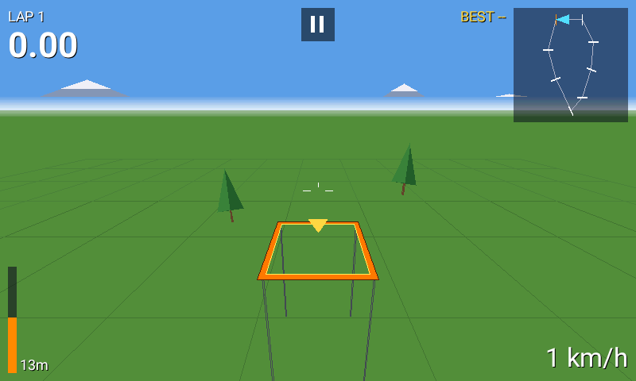

# EdgeTX FPV Sim

A real 3D FPV quad racing simulator that runs **on your radio** as an EdgeTX Lua tool, on every color screen and on black & white radios. A browser emulator runs the very same scripts, so you can try it before copying it to the SD card.

| TX16S (480×272) | NV14 / EL18 (320×480) | TX16S MK3 (800×480) |
|---|---|---|
|  |  |  |
|  | **TX12 / Zorro / X7 (128×64)**  | **X9D+ (212×64 grey)**  |

## Features

- **Full 3D flight.** Thrust-to-weight, quadratic drag, momentum and gravity, integrated at 80 Hz. Acro (rate) or Angle (self-level) mode, Betaflight "actual" rates (Soft / Normal / Fast), camera uptilt 0–50°, field of view 80–120°, power 3:1 / 4:1 / 6:1.
- **Three tracks.** Meadow, Figure 8 and Dive Tower: gates on the ground, high gates on legs and a flat dive gate. Trees and gate legs are solid, so you can crash.
- **Race, Practice and Free fly.** 3-2-1 countdown, gate beeps, lap split against your best, haptic on crash, respawn at the last gate. Best lap and best race are saved per track.
- **Color radios.** Filled sky and ground at any attitude, horizon haze, distance fog, mountains, solid gates with outlines, trees, FPV-style OSD (lap timer, best, speed, altitude, throttle bar, next-gate marker and arrow), minimap, optional stick view and FPS. Touch works on touch radios (menus, pause button).
- **B&W radios.** The same game in wireframe 3D, with greyscale ground on 212×64 screens.

## Install

1. Copy the file for your radio from `sdcard/SCRIPTS/TOOLS/` to `/SCRIPTS/TOOLS/` on the radio's SD card:
   - `FPVSim.lua` for color radios
   - `FPVSimBW.lua` for black & white radios
2. On the radio open **SYS → Tools** and start **FPV Sim**. The first start takes a few seconds while EdgeTX compiles the script.

> **Safety:** the radio keeps transmitting your sticks while the sim runs. Unplug the quad's battery or switch the RF module off first.

## Controls

| | |
|---|---|
| Sticks | Fly the quad. The radio applies your stick mode (1–4). |
| ENTER | Select. On a setting it starts editing; turn or press +/- to change it. |
| EXIT | Pause while flying, back in menus, quit from the main menu. Long EXIT closes the tool on color radios. |
| Rotary, +/-, up/down | Move through menus. |
| Touch | Tap menu rows. On a setting, tap the left part to go back a value, the right part to go forward. The pause button sits at the top of the screen (bottom of the panel on portrait radios). |

## Supported screens

| Screen | Radios |
|---|---|
| 480×272 | RadioMaster TX16S / MkII, FrSky X10 / X10S / X12S, Jumper T16 / T18, HelloRadioSky V16, Fatfish F16, iFlight Commando 14, Senduwing H17 |
| 480×320 | RadioMaster TX15 / GX15, Jumper T15 / T15 Pro / T22, FlySky PL18 / PL18EV / PL18U / ST16 |
| 320×480 | FlySky NV14, EL18, NB4+ (portrait: FPV view on top, instruments below) |
| 320×240 | FlySky PA01, HelloRadioSky V12 |
| 800×480 | RadioMaster TX16S MK3 |
| 212×64 grey | FrSky X9D, X9D+, X9D+ 2019, X9E |
| 128×64 | RadioMaster TX12 / MkII, Zorro, Boxer, Pocket, MT12, GX12, FrSky X7 / X-Lite / X9 Lite, Jumper T-Lite, T-Pro, T12, T14, T20, Bumblebee, BetaFPV LR3 Pro, and the other 128×64 radios |

The layout is computed from `LCD_W` / `LCD_H` and the radio's real font sizes, so new screen sizes work too. Tested with Lua 5.3 as configured in EdgeTX 2.11+ and with Lua 5.2 (EdgeTX 2.10 and older).

## How it stays fast on a radio

EdgeTX calls a tool script's `run()` at most every 50 ms, so the target is a steady 20 fps on the slowest color radios (STM32F429).

- **Timing.** The flight model uses `getTime()` deltas with 80 Hz substeps, so the flight is the same at any frame rate.
- **Lines over fills.** `lcd.drawLine` is native Bresenham, but a filled triangle costs one LVGL call per scanline. Sky and ground therefore use one rectangle plus one thin wedge triangle at any roll angle. Gate bars are filled with 1 px "ruled" lines, tree trunks are lines, and the lit half of a tree is drawn only for near trees.
- **Lua side.** World data is stored as arrays of numbers, hot values live in locals, no tables are created per frame, objects are depth-sorted with an insertion sort, collisions use a per-frame broad phase, and far gates switch to a single outline.
- **Measured per frame:** about 13–18k Lua VM instructions and 700–900 triangle rows on color screens, 7–10k instructions on B&W. The emulator estimates about 16–18 ms per frame on a TX16S-class radio, inside the 50 ms budget.
- **EdgeTX Lua quirk.** EdgeTX builds Lua 5.3 with `LUA_FLOORN2I`, and releases before the 2026-08-30 fix (#7611) also floor floats in int/float equality, so `0.02 ~= 0` is `false` on those radios. The script never compares a float with an integer literal.
- **B&W quirks.** `lcd.drawLine` on B&W radios refuses any point outside the screen and draws in XOR mode unless `FORCE` is set, so lines are clipped in Lua and drawn with `FORCE`.

## Browser emulator

Open `web/simulator.html` in Chrome, Edge or Firefox. It runs the real `.lua` files in a Lua 5.3 VM with an EdgeTX-style API and draws them pixel by pixel the way the firmware does.

- Pick any radio screen, color or B&W.
- Fly with the keyboard (W/S throttle, A/D yaw, arrows for pitch and roll), drag the on-screen gimbals, or plug in your radio as a USB joystick (choose **Radio / gamepad** and map the axes).
- Runs at the radio's 20 Hz by default, with optional B&W LCD ghosting.
- The **Radio load** panel counts Lua instructions and drawing work per frame and estimates the frame time on F4 and H7 radios.
- **Open .lua** runs any other EdgeTX tool script.

## Development

```
src/fpvsim.lua          single source for both scripts (--#if COLOR / --#if BW blocks)
build.py                -> sdcard/SCRIPTS/TOOLS/FPVSim.lua and FPVSimBW.lua
web/src/                emulator: engine.js (EdgeTX API + LCD), app.js (UI), style.css, index.html
tools/bundle_web.py     -> web/simulator.html (offline, single file) and web/artifact.html
tools/build_etxlua.sh   builds a Lua 5.3 with EdgeTX's number settings for the tests
test/harness.lua        headless EdgeTX mock: autopilot races on every track, menus, crashes, saving
test/run_all.sh         runs the harness for every screen size (Lua 5.3, plus Lua 5.2 via lupa)
test/web_shots.py       Playwright screenshots of the emulator on every radio
```

```
python3 build.py && python3 tools/bundle_web.py
tools/build_etxlua.sh && test/run_all.sh
```

## Credits

- Idea from [lua-fpv-sim](https://github.com/alexeystn/lua-fpv-sim) by Alexey Stankevich, the first FPV sim on OpenTX. This project is an independent rewrite with a 3D engine.
- Emulator: [fengari](https://fengari.io) Lua VM (MIT), Roboto font (SIL OFL), X11 misc-fixed bitmap fonts (public domain). License texts are in `web/vendor/`.
